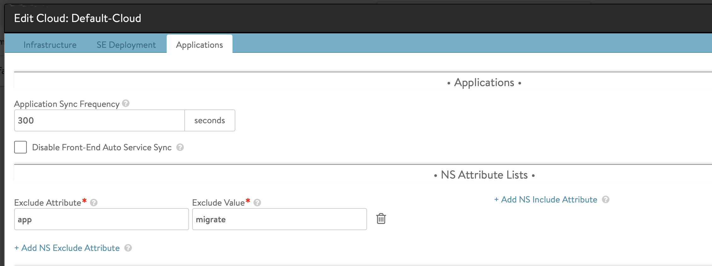

# Cloud connector to AKO migration
## Overview
Cloud connector(CC) is not supported from Avi Controller version 20.1 onwards. To migrate existing workload present in kubernetes cluster from cloud connector to AKO, following two features will be used.

* <b>Namespace-Driven Inclusion/Exclusion of OpenShift/Kubernetes Applications</b>:

    For migration activity,  Exclusion feature allows ingresses/routes from specific namespace(s) to be deleted(excluded) from Avi Controller. For that namespace has to be labelled with same key:value pair as that of exclusion attributes mentioned in cloud. This feature is supported in Cloud Connector based Avi Controller. 

    Details about enabling exclusion feature can be found [here](https://avinetworks.com/docs/18.2/namespace-inclusion-exclusion-in-openshift-kubernetes/)

* <b>Namespace Sync feature</b>

    Namespace sync feature allows K8 objects from specific namespace to be synced with Avi-Controller. For that, namespace has to be labelled with same key:value pair as that labelKey and labelValue mentioned in values.yaml. This feature is supported by AKO from 1.4.1. 
    
    Details about this feature is at: [Namespace Sync in AKO](objects.md#namespace-sync-in-ako)

So crux of migration activity to remember is to use same "key:value" pair 

1. as an exclusion attribute in Cloud connector setup.
2. as a namespace selector in AKO
3. as a label to namespace whose kubernetes objects needs to be migrated.

This will delete virtual services from CC based Avi-controller and create new virtual services at AKO based Avi-Controller for ingresses, L4 services of that namespace.

## Workflow

This section gives details about steps of migration.

### 1. Preparation for migration

*  Setup a new controller (compatible with AKO version 1.4.1 and above)
*  Setup a new Vcenter cloud with IPAM.
*  Setup a DNS Service
*  Replicate AVI side objects referred by Ingresses/Services as part of AVI_PROXY annotations to new           controller.

### 2. Deploy AKO CRDs

For each AVI_PROXY annotation present in an ingress, create corresponding AKO Http rule/Host rule/ AviInfrasetting rule. 
Details of these CRDs can be found out [here](crds/overview.md)

If any AVI_PROXY annotation is not supported by these CRDs, then VS which is migrated to AKO will not have same features as that in CloudConnector. 

### 3. AKO Deployment

Deploy AKO (version 1.4 and above) with namespace sync feature enabled.

As an example, AKO is deployed with `app` as a key and `migrate` as a value for namespace selector. So AKO will sync up all objects from namespace(s) with this label and corresponding Avi objects will be created in Avi-Controller.

### 4. Namespace-Driven Exclusion of OpenShift/Kubernetes Applications

Set an exclude attribute for cloud connector cloud (Openshift Cloud) either from UI or AVI shell. Key and value should be same as mentioned in AKO.

* Setting up exclusion attribute using UI

* Setting up exclusion attribute using Avi shell

As an example, exclusion attribute as `app` and exclusion value as `migrate` is used. This will delete virtual services of namespace(s), which has same label, from CloudConnector Avi-Controller.

### 5. Kubernetes namespace label

Label namespace(s) in kubernetes cluster with same `key:value` pair.

As shown in above snippet, "red" namespace is labelled with "app: migrate". This will result in deleting virtual services of red namespace from CC Avi-controller and creating new virtual services for red namespace in AKO Avi-controller. There will be traffic disruption during migration.

### 6. Internal testing

When objects migrates to new AKO Avi controller, it acquires new VIP. With that new VIP, do internal traffic test for migrated applications.

After successful testing, objects from remaining namespaces can be migrated by labelling namespace with valid label (as done in step 5).

### 7. Client traffic redirection

Once all ingresses, L4 services migrated to AKO Avi controller, client traffic can be redirected to new Vips by 
* either changing DNS server entry in corporate DNS server to point out to new DNS service from AKO based Vcenter Cloud 
* or changing dns service IP address, of Vcenter cloud, to old CC dns VIP.

### 8. Cloud Connector (Openshift cloud) clean up

Once all kubernetes objects migrated and tested, old Cloud Connector (Openshift cloud) can be deleted.

